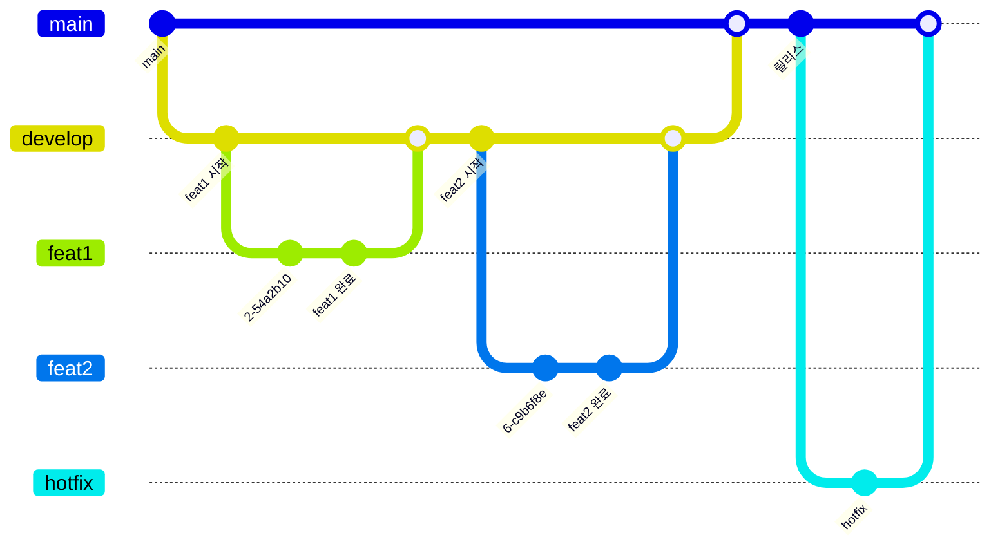

# 2025-C3-M6-`FunForYou(여가어때)`
Apple Developer Academy@Postech 4th Learners

## Team PR 규칙
- PR 템플릿 양식에 맞추되, 개발한 기능 중심 설명으로 작성합니다.
- 개발한 뷰의 이미지 하나 이상 첨부해야 합니다.
- PR Merge는 한명이 담당합니다.
- PR Title 은 다음의 깃모지를 붙여 작성합니다.

| 이모지 | 태그        | 설명                                |
|:------:|:------------|:-------------------------------------|
| ✨     | **Feat**     | 새로운 기능 추가                     |
| 🐛     | **Fix**      | 버그 수정                            |
| ✅     | **Chore**    | 그 외 자잘한 수정                    |
| 🍱     | **Asset**    | assets 추가 또는 변경                |
| 💄     | **Style**    | UI/스타일 관련 작업 (기능 변경 X)    |
| 🗃️     | **DB**       | 데이터베이스 관련된 수정             |
| 👷     | **Build**    | 빌드 관련 파일 수정                  |
| 🔥     | **Remove**   | 코드나 파일 삭제                     |
| 📝     | **Docs**     | 문서 작성/수정/삭제 (README 등)     |
| ♻️     | **Refactor** | 리팩토링 (네이밍 변경 포함)          |
| 🚧     | **Construction** | 아직 공사 중                    |

## 🕊️ 브랜치 전략

## 코딩 컨벤션
코딩 컨벤션은 다음의 아카데미 공식 swift-style-guide 를 따릅니다.

https://github.com/DeveloperAcademy-POSTECH/swift-style-guide

## ✍️ Authors

  
| [ Ted](https://github.com/keon22han) | [ Yeony](https://github.com/keon22han) | [ Ssol](https://github.com/msseock) |
| :---: | :---: | :---: |
| [ Woody](https://github.com/keon22han) | [ Berry](https://github.com/keon22han) | [ Fine](https://github.com/keon22han) |

